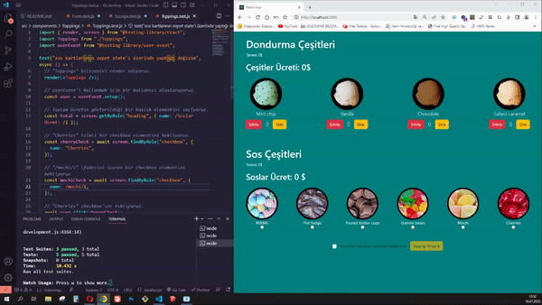

<h1>TEST SENARYOLARI</h1>

Bu proje, React bileşenlerinin test senaryolarını içermektedir. Aşağıda, her bir test senaryosuna ve testlerin nasıl çalıştırılacağına ilişkin bilgilere yer verilmiştir.

<h3>Test Senaryosu Adı:</h3>koşulların onaylanmasına göre buton aktifliği
<h4>Test Senaryosu Açıklama:</h4> Koşulların işaretlenmesi durumunda, "siparişi onayla" adlı butonun etkinleştiğini ve işaretin kaldırılması durumunda tekrar devre dışı olduğunu kontrol eder.

<h3>Test Senaryosu Adı:</h3> buton üzerine mouse geldiğinde açıklama kutucuğu çıkıyor mu

<h4>Test Senaryosu Açıklama:</h4> Buton üzerine mouse gelindiğinde, açıklama kutucuğunun görünür hale geldiğini ve mouse'un buton üzerinden çekildiğinde tekrar gizlendiğini kontrol eder.

<h3>Test Senaryosu Adı:</h3>API'den gelen her kategori için ekrana bir kart basılır

<h4>Test Senaryosu Açıklama:</h4> Scoops bileşeninde, API'den gelen her kategori için ekrana bir kart basıldığını ve toplamda 4 kart olduğunu kontrol eder.

<h3>Test Senaryosu Adı:</h3> Dondurma çeşitlerinde ekleme ve sıfırlamaya göre toplamın değişimi

<h4>Test Senaryosu Açıklama:</h4> Scoops bileşenindeki dondurma çeşitlerine ekleme ve sıfırlama işlemleri yaparak toplamın doğru şekilde değiştiğini kontrol eder.

<h3>Test Senaryosu Adı:</h3>Sos Kartlarının Sepet State'i Üzerinde Yaptığı Değişim

<h4>Test Senaryosu Açıklama:</h4>Bu test senaryosu, "Toppings" bileşenindeki sos kartlarına yapılan seçimlerin sepet state'i üzerinde doğru şekilde değişiklik yapılıp yapılmadığını kontrol eder.

<a href="https://unittesting-icecream.netlify.app">Canlı Önizleme</a>

